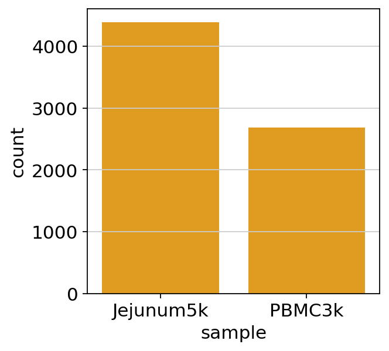
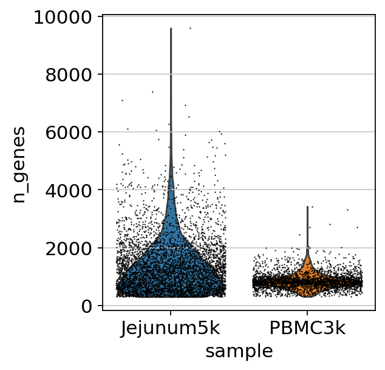
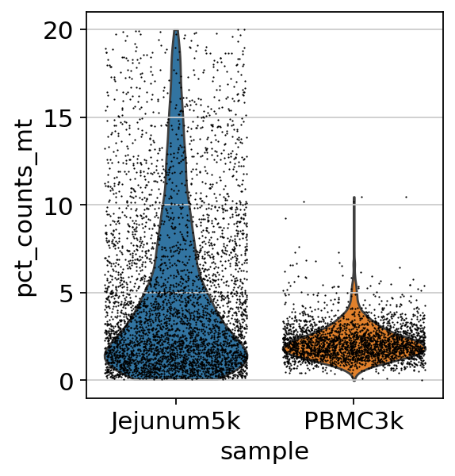
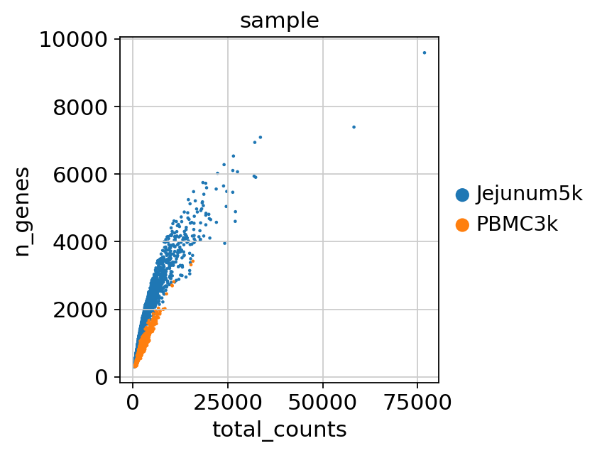
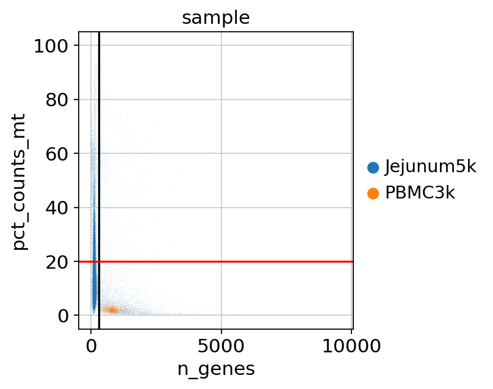
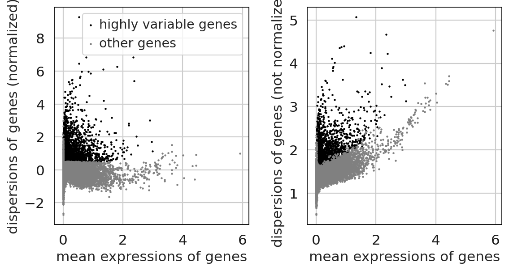
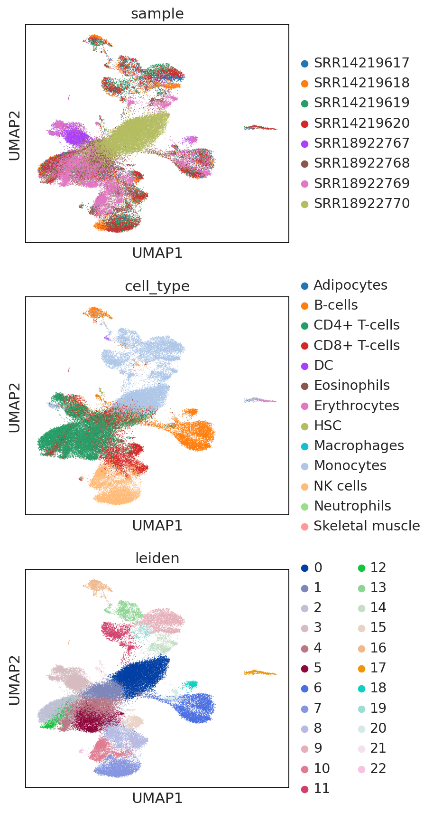

# immunespace/scintegrator: Output

## Introduction

This document describes the output produced by the pipeline.
The directories listed below will be created in the results directory after the pipeline has finished. All paths are relative to the top-level results directory.

<!-- TODO nf-core: Write this documentation describing your workflow's output -->

## Pipeline overview

The pipeline is built using [Nextflow](https://www.nextflow.io/) and processes data using the following steps:

- [Scanpy_QC](#Scanpy_QC) - Detail the preprocessing steps implemented in Scanpy, including doublet removal, rigorous Quality Control (QC), and the generation of comprehensive plot reports.
- [Scanpy_Clustering](#Scanpy_Cluster) - Scanpy clustering workflow, including data normalization, log transformation, removal of TR and IG genes, identification of highly variable genes, PCA analysis, cell clustering, and cell type annotation.
- [MultiQC](#multiqc) - Aggregate report describing results and QC from the whole pipeline.
- [Pipeline information](#pipeline-information) - Report metrics generated during the workflow execution.

### Scanpy_QC

Output files

- `assets/`
  - `pipeline_QC.ipynb`: Quality control plot reports.

Quality control plot reports.

#### Cell Count Plot
This plot visualizes the count of cells analyzed across different samples after after cell filtering that do not meet certain quality metrics, such as a minimum number of genes expressed or an excessive percentage of mitochondrial gene expression.

#### Number of Genes per Cell Plot
This plot shows the distribution of the number of genes detected in each cell across different samples after excluding genes that are not detected in a sufficient number of cells.

#### Percentage of Mitochondrial Genes Plot
This plot displays the percentage of mitochondrial genes found in each cell across samples after filtering the cells with high percentage of mitochondrial genes.

#### Total Counts vs. Number of Genes
This plot visualizes the relationship between the total number of transcript counts and the number of genes detected of the cells across samples that have passed all quality controls.

#### Number of Genes vs. Percentage of Mitochondrial Genes
This plot compares the number of genes per cell with the percentage of mitochondrial genes across samples that have passed all quality controls.

### Scanpy_clustering

Output files

- `assets/`
  - `pipeline_cluster.ipynb`: Clustering and cell annotation reports.

Scanpy clustering performs data normalization, log transformation, removal of TR and IG genes, identification of highly variable genes, PCA analysis, cell clustering, data integrtion and cell type annotation.

Highly variable genes identification, clustering and cell type annotation plots.

### Pipeline information

Output files

- `pipeline_info/`
  - Reports generated by Nextflow: `execution_report.html`, `execution_timeline.html`, `execution_trace.txt` and `pipeline_dag.dot`/`pipeline_dag.svg`.
  - Reports generated by the pipeline: `pipeline_report.html`, `pipeline_report.txt` and `software_versions.yml`. The `pipeline_report*` files will only be present if the `--email` / `--email_on_fail` parameter's are used when running the pipeline.
  - Reformatted samplesheet files used as input to the pipeline: `samplesheet.valid.csv`.
  - Parameters used by the pipeline run: `params.json`.

[Nextflow](https://www.nextflow.io/docs/latest/tracing.html) provides excellent functionality for generating various reports relevant to the running and execution of the pipeline. This will allow you to troubleshoot errors with the running of the pipeline, and also provide you with other information such as launch commands, run times and resource usage.
